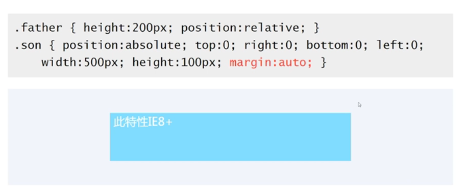
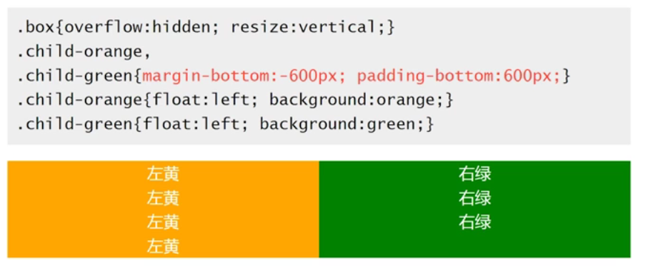

## Margin属性

### margin的相关属性
margin用于设置元素的四个外边距，后面的值可以是1~4个， 
一个参数，例如：margin:10px;表示四边外边距10像素； 
两个参数，例如：margin:10px 5px;表示上下外边距10像素，左右外边距5像素；  
三个参数，例如：margin:10px 5px 2px;表示上外边距10像素，左右边距5像素，下边距2像素；  
四个参数，例如：margin:10px 5px 2px 1px;表示上外边距10像素，右外边距5像素，下外边距2像素，左外边距1像素。  
记忆：四个参数分别表示上、右、下、左（顺时针方位），当缺失值时，会设置成其对称方位的值。  

对于未设置width值得block元素，可以通过margin-left/margin-right控制元素宽度，无法控制其高度；若设置width值，margin-left/margin-right不会再改变其宽度。  
块级元素的四个方向的margin值均有效；内联元素，只有margin-left/margin-right起作用  

这个时候有些人可能会有疑问，为什么有时候设置margin-right/margin-bottom元素并没有改变其位置呢？ 
这是因为margin是控制外边距的，也就是同级元素之间的间隔，并不是它距父元素底部的距离。

### 可能的值
（1）auto  
（2）length 规定以具体单位计的外边距值，比如像素、厘米等。默认值是 0px。  
（3）%   规定基于父元素的宽度的百分比的外边距。  
    普通元素的百分比margin都是相对于容器的宽度计算的（无论垂直还是水平方向的，都是相对于容器的宽度）；  
（4）绝对定位元素的百分比margin是相对于第一个定位祖先元素（relative/absolute/fixed）的宽度计算的。  
（5）负值

### margin重叠问题
重叠在常规流向中只会发生在垂直方向，不考虑writing-mode改变流向的前提下 

#### 1.重叠的好处 
（1）重叠可以是段落或者列表之间排版自然； 
（2）任何地方嵌入裸div都不会影响原来的布局； 
（3）任意多空
不影响原来布局排版

#### 2.重叠的前提
（1）	作用于block水平的元素（不包括float、absolute）  
（2）	不考虑[Writing-mode]()，只发生在垂直方向重叠（margin-top/margin-bottom）  
Writing-mode会造成文档流向的改变，对立流向的margin会发生重叠  

#### 3.重叠的计算规则
（1）	都为正值时，去最大的值  
（2）	有正值有负值时，相加  
（3）	都为负值时，取绝对值最大的负值   

#### 4.重叠的三种情景
 1. 相邻的兄弟元素，相邻块级盒子（同胞）之间的垂直外边距只有在它们处于同一个[BFC]()时才会发生折叠。

 2. 父级和第一个和最后一个子元素：父子元素会共用一个margin，给父元素或者子元素或者两者同时设置效果是一样的，都是以父元素的margin显示

|margin-top重叠 
|-----
|父元素非块状化上下文: overflow:hidden;
|父元素没有border-top;
|父元素没有padding-top设置（包括padding-top:0);
|父元素和第一个子元素之间没有inline元素分隔: 插入空格&nbsp;
      

|margin-bottom重叠|	
|----|
|父元素非块状化上下文: overflow:hidden
|父元素没有border-bottom
|父元素没有padding-bottom设置（包括padding-top:0)
|父元素和最后一个子元素之间没有inline元素分隔: 插入空格
|父元素没有height相关声明 
    
|空的block元素,上下边距重叠
|----|
|元素没有border-bottom；
|元素没有padding-bottom设置（包括padding-top:0)；
|里面没有inline元素分隔: 插入空格
|没有height或者min-height相关声明

#### 解决margin重叠 
   根据以上发生重叠的情景，进行相应的设置

### margin值为auto（block元素才会起作用）
   auto值得作用机理：计算分配剩余空间。当block元素未设置width时，宽度会自动填充容器，所以当给了width值，auto值会自动计算剩余空间，左右auto可以实现水平居中；因为不设置高度时，容器不会自动填充，也就没有剩余空间可计算，所以垂直方向的auto不起作用，不能实现垂直居中。 

 1. 某个方向的居中
  * 设置图片的水平居中，可讲图片设置为display:block;
  * 垂直方向的居中，可设置writing-mode：vertical-lr改变流向
 2. 结合absolute实现绝对居中
  * 对块状元素（需要设置宽高）以及内联元素均适用  
      
 
### margin值为负时
  1. 列表横向排列实现两端对齐
        
  2. 实现等高布局

    利用很大的margin-bottom负值,并且利用绝对值相等的padding-bottom值相抵消 
      

  3. 两栏自适应布局

    左边浮动元素设置margin-right正值，右边浮动的元素设置margin-left负值。

### margin百分比值的应用

实现宽高自适应矩形

