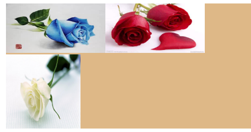
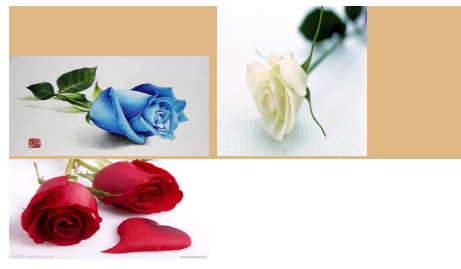
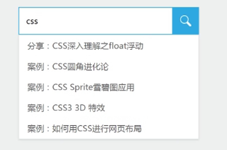

## absolute定位
 absolute属性的出现本来是想把页面搞得像photoshop那样，一个图层一个图层覆盖似的，不会影响正常流中的布局

### absolute的初始位置与加了left/top后的位置
 position为absolute的元素如果没有设置left,top等值与未设置left、top效果为何不一样？
    1. 设置了left、top(包括left:0;top:0)
      这个absolute元素立马变身，直接从DOM tree里面脱离，独立于文档流，结果相对于最近的非static属性的祖先标签定位（如果没有，就body定位）
    2. 未设置left、top
      相对于原来的位置脱离文档流（位置跟随），因为会造成父元素高度塌陷

### absolute特性
    1. 包裹性，父元素设置absolute，其子元素会自动撑开父容器; 

    2. 破坏性，子元素设置absolute; 
      但是由于absolute属性（尤其是带有left/top值）的破坏性，会导致高宽塌陷，所以父元素需要设定一个高度值（或是足以撑开高度的值）。 
    例如：新浪微博导航就是绝对定位，于是，导航外标签必须定高，否则，下面的元素会上来发生重叠

    3. absolute与去浮动
      绝对定位生效时浮动会失效，浮动生效时绝对定位失效

    4. 位置跟随（使用 absolute + margin 实现位置跟随，叠加效果）
      用了绝对定位后，原来是什么位置，还是什么位置；
    css代码

    
    

        
        
        
    

 

     

      
      
      
     

 

    5. 绝对定位的爆裂拉升（IE以上支持），使用对立值left-right/top-bottom
      * 拉升与width/height同时存在时，会先满足其width/height属性，然后是left/top以及right/bottom;  
      * 父容器实现拉升后，内部元素width/height可设置百分比，例如宽高自适应的九宫格布局;  
      * 当存在相等的对立值left-right/top-bottom时，并且遭遇margin：auto，能够实现对立方向的绝对居中（IE8+）; 

总结： 
1.动画尽量作用在绝对定位的元素上，这样会避免回流和重绘； 
2.对定位元素直接放在body标签下，才能最大限度的发挥绝对定位元素的才能； 
3.将绝对定位元素被relative限制在很深的DOM节点中，增加了DOM的复杂度，不利于维护；

最后，也是更重要的，就是绝对定位大大降低了页面的扩展性和维护性。其在降低维护性方面的卓越表现不仅仅在于自身，还在于其领导能力（指引领relative与z-index制造更加混乱的页面，这个后面会依次讲到）。
所以，absolute尽量不要身陷林立的DOM中，想重构高质量的页面，少用绝对定位布局！或者使用margin+absolute发挥其位置跟随特性，尽量避免使用relative限制

#### 位置跟随的应用：
    1.下拉框

 
    2.位置跟随

 
    3.利用空字符（text-align:center）加margin偏移实现图标水平居中

