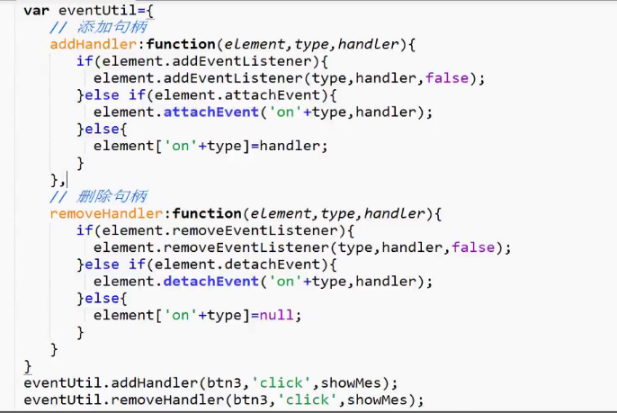

### 事件流
一般事件流包括三个阶段：事件捕获阶段、处于目标阶段和事件冒泡阶段

### 事件
	1. 事件冒泡
	事件最开始由最具体的元素接收，即嵌套最深的节点，然后逐级向上传播值文档节点。捕获阶段的主要任务是建立传播路径
	2.事件捕获
	与事件冒泡相反，最不具体的节点先接受事件，最具体的节点最后接收到事件

### 使用事件处理程序
    1.HTML事件处理：直接在HTML上加载事件
      缺点：html和js代码耦合

    

        <input type="button"  onclick="alert('hello1')" value="按钮"/>
    

 上述代码，点击按钮，会先弹出 “hello 1”，接着“hello 0”

    2.DOM0级事件处理程序
      把一个函数赋值给一个事件处理程序的属性。
      优点：用的比较多的方法，用法简单，可以跨浏览器

    

    3.DOM2级事件处理程序
      DOM2级事件定义了两个方法，用于处理指定和删除事件处理程序的操作：
        addEventListener()/removeEventListener(),需要接收三个参数：
        A．要处理的事件名：如："click"/"mouseover"…，都不要"on";
        B.作为事件处理的具体函数;
        C.布尔值：默认值为 false, 即冒泡传递，当值为 true 时, 事件使用捕获传递。
      优点：DOM2级可以给同一个事件绑定多个函数，会按绑定顺序依次执行
      缺点：IE9+才支持

    

    4.IE事件处理程序
      attachEvent()添加事件，如"onclick"，需要加"on"，并且事件处理程序会在全局作用域中运行，因此函数内部的 this 等于 window;
      detachEvent()删除事件;
    接收两个参数：事件处理名称、事件处理函数。不使用第三个参数的原因：IE8以及更早的浏览器版本只支持事件冒泡

    5.跨浏览器的事件处理

 

### 事件对象

在触发dom上的事件时，都会产生一个事件对象event

    1.DOM中常见的事件对象
      (1) type，用于获取事件类型，点击还是滑过；
      (2) target，用于获取事件目标，即哪个元素的事件；
      (3) stopPropagation()，用于阻止事件冒泡（向上传递）；
      (4) preventDefault()，通知浏览器不要执行与事件关联的默认动作，比如a标签的默认跳转。

    2.IE中常见的事件对象
	  (1)type，用于获取事件类型，点击还是滑过；
      (2)srcElement，用于获取事件目标；
      (3)cancelBubble，用于阻止事件冒泡,true为阻止；
      (4)returnValue属性，如果将returnValue设置为false，就会取消默认事件的处理。

    function showMes(event){
        alert(event.target);
        //阻止冒泡
        if(event.stopPropagation){
            event.stopPropagation();
        }eles{
            event.cancelBubble = true;
        }
    }

封装的完整的跨浏览器DOM事件源代码请见后续内容

