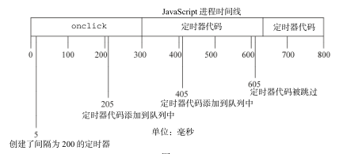

 setTimeout() 和 setInterval()

## 定时器原理
JS是单线程的，可以把 JavaScript 想象成在时间线上运行的，在页面下载完后的代码运行、事件处理程序、Ajax 回调函数都必须使用同样的线程来执行。
实际上，浏览器负责进行排序，指派某段代码在某个时间点运行的优先级。
除了主 JavaScript 执行进程外，还有一个需要在进程下一次空闲时执行的代码队列。随着页面在其生命周期中的推移，代码会按照执行顺序添加入队列，在 JavaScript 中没有任何代码是立刻执行的，但一旦进程空闲则尽快执行。

定时器对队列的工作方式是，在定时器函数被调用后，当特定时间过去后将代码插入队列等待执行。注意，给队列添加代码并不意味着对它立刻执行，而只能表示它会尽快执行，只有js线程空闲时才会处理。

请看下面代码，在这里给一个按钮设置了一个事件处理程序。事件处理程序设置了一个 250ms 后调用的定时器。

    var btn = document.getElementById("my-btn");
    btn.onclick = function(){
        setTimeout(function(){
            document.getElementById("message").style.visibility = "visible";
        }, 250);
        //其他代码
    };

   点击该按钮后，首先将 onclick 事件处理程序加入队列。该程序执行后才设置定时器，再有 250ms后，指定的代码才被添加到队列中等待执行。
    如果前面例子中的 onclick 事件处理程序执行了 300ms，那么定时器的代码至少要在定时器设置之后的 300ms后才会被执行。
  队列中所有的代码都要等到 JavaScript 进程空闲之后才能执行，而不管它们是如何添加到队列中的。

## 重复的定时器
 setInterval()创建重复定时器。确保了定时器代码规则地插入队列中。

 1. 执行规则

 使用 setInterval() 时，仅当队列中没有该定时器的任何其他代码实例时，才将定时器代码添加到队列中。因为如果定时器代码执行时间大于间隔时间，就会导致其连续运行。

    假设，某个 onclick 事件处理程序使用 setInterval() 设置了一个 200ms 间隔
    的重复定时器。 如果事件处理程序花了 300ms多一点的时间完成。

   

 2. 该规则带来的问题：

 (1) 某些间隔会被跳过；

 (2) 多个定时器的代码执行之间的间隔可能会比预期的小。

 3. 链式调用setTimeout()

 为了避免这两个问题，可以使用链式 setTimeout()调用：

        setTimeout(function(){
        	//处理中
            setTimeout(arguments.callee, interval);
        }, interval);

在js动画中使用这个模式很常见。

## yield process
在浏览器中的JS都被分配了一个确定数量的资源。需要的内存大小和处理器时间都被严格限制了，防止恶意的Web程序员把用户机器资源耗尽。
代码运行超过特定的时间或者特定语句数量就不让它继续执行。
脚本长时间运行的问题通常是由两个原因之一造成的：过长的、过深嵌套的函数调用或者是进行大量处理的循环。

那么如何解决这种问题？

    对于后者，可以使用定时器分割这个循环。这是一种叫做数组分块(array  chunking)的技术，小块小块地处理数组。

基本思路：为要处理的项目创建一个队列，然后使用定时器取出下一个要处理的项目进行处理，接着再设置另一个定时器。

一般的循环：

    for (var i=0, len=data.length; i < len; i++){
        process(data[i]);
    }

实现数组分块：

    function chunk(array, process, context){
        setTimeout(function(){
            //取出下一个条目并处理
            var item = array.shift();
            process.call(context, item);

            //如何还有其他条目，再设置另一个定时器
            if (array.length > 0){
                setTimeout(arguments.callee, 100);
            }
        }, 100);
    }

数组分块使用条件：

 1. 某个循环占用了大量时间；
 2. 不需要同步处理；
 3. 不需要按顺序完成。一般数组只是对项目的组合和迭代的一种简便的方法而无所谓顺序。

## 函数节流
浏览器中某些计算和处理要比其他的昂贵很多。例如，DOM 操作比起非 DOM 交互需要更多的内
存和 CPU 时间。连续尝试进行过多的DOM相关操作可能会导致浏览器挂起，有时候甚至会崩溃。

函数节流的基本思想是：
    某些代码不可以在没有间断的情况连续重复执行。第一次调用函数，创建一个定时器，在指定的时间间隔之后运行代码。当第二次调用该函数时，它会清除前一次的定时器
并设置另一个。频繁执行时只执行一次，一般是最后一次。

    function debounce(method, context) {
        clearTimeout(method.tId);
        method.tId= setTimeout(function(){
            method.call(context);
        }, 100);
    }

## 函数防抖
只允许一个函数在N秒内执行一次

    function throttle2(method, delay, time) {
         var timeout,startTime = new Date();
         return function() {
             var context = this,
             args = arguments,
             curTime = new Date();
             clearTimeout(timeout);
             // 如果达到了规定的触发时间间隔，触发 handler
             if (curTime - startTime >= time) {
               method.apply(context, args);
               startTime = curTime;
               // 没达到触发间隔，重新设定定时器
             } else {
               timeout = setTimeout(method, delay);
         }
    };

